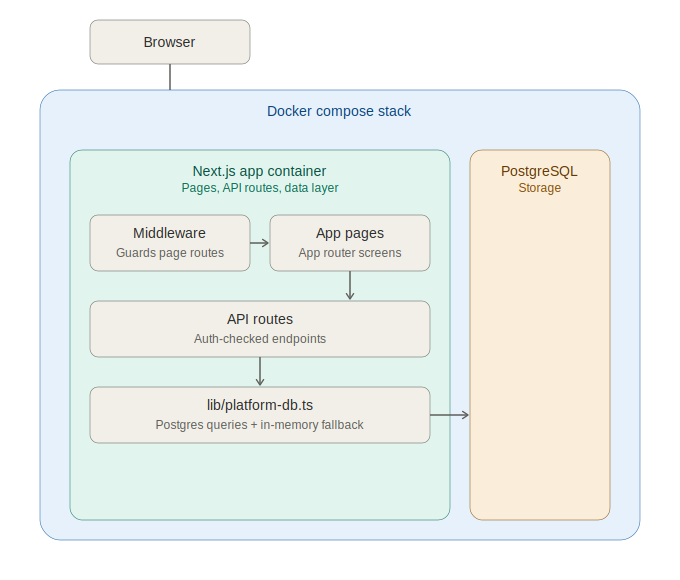

# Architecture

## Request flow

1. **Browser** — the user's device. Sends page navigations and `fetch()` calls
   to the Next.js app.
2. **Middleware** (`middleware.ts`) — runs on every matched request before any
   page renders. Validates the signed `session` cookie (HMAC-SHA256) and
   redirects unauthenticated visitors away from protected pages
   (`/dashboard`, `/bank-accounts`, `/bank-transfer`, `/pay-bills`,
   `/e-statement`, `/smart-spend`) to `/login`.
3. **App pages** (`app/**/page.tsx`) — the actual screens. These are client
   components that call the API routes below to read/write data.
4. **API routes** (`app/api/**/route.ts`) — one route per resource
   (`accounts`, `transfer`, `transactions`, `search`, `auth/login`,
   `auth/signup`, `admin/system`, `setup`, `health`). Each route re-validates
   the session cookie itself (independent of middleware, since middleware
   only guards page navigation, not API calls) and enforces row-level
   ownership — a non-admin can only see/modify their own accounts and
   transactions.
5. **`lib/platform-db.ts`** — the single data-access layer. Wraps a `pg`
   connection pool and exposes typed helper functions
   (`findUserByUsername`, `transferFunds`, etc.). If Postgres is unreachable
   at boot, it transparently swaps to an in-memory fallback store seeded with
   the same demo data, so local development still works without Docker.
6. **PostgreSQL** — the real datastore, run as a separate service in
   `compose.yml`. Holds `users`, `accounts`, `transactions`, and
   `audit_logs`.

## Why middleware and API routes both check auth

Next.js middleware only runs for page navigations matched in its `config`
export — it does not intercept `fetch()` calls made from the browser to
`/api/*`. So even though middleware blocks an unauthenticated user from
*loading* `/bank-transfer`, someone could still call
`POST /api/transfer` directly with `curl`. That's why every API route parses
and verifies the session cookie independently rather than relying on
middleware to have already done it.
